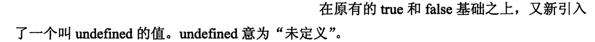

# 程序员的数学1
* ###### 将多个命题进行结合，需要用到逻辑运算符
  > 建立复杂命题 [P45](bookxnotepro://opennote/?nb={dc84f68f-30dc-41aa-b9da-b296f9b07105}&book=d3ca0b1c9296c4f4e1b519b03bdd77c2&page=45&x=113&y=167&id=10)
  
    * ###### 逻辑非的真值，A为真，则非A为假
      > 建立这种“不是……＂的命题的运算称作非，英语中用 not 表示。 [P45](bookxnotepro://opennote/?nb={dc84f68f-30dc-41aa-b9da-b296f9b07105}&book=d3ca0b1c9296c4f4e1b519b03bdd77c2&page=45&x=198&y=361&id=1)
      
        * ###### 真值表证明非非A的结果等于A
          >  [P46](bookxnotepro://opennote/?nb={dc84f68f-30dc-41aa-b9da-b296f9b07105}&book=d3ca0b1c9296c4f4e1b519b03bdd77c2&page=46&x=255&y=525&id=3)
    * ###### 外围的矩形表示全集，矩形的内部椭圆表示命题
      > 文氏图原本是表示集合关系的图 [P47](bookxnotepro://opennote/?nb={dc84f68f-30dc-41aa-b9da-b296f9b07105}&book=d3ca0b1c9296c4f4e1b519b03bdd77c2&page=47&x=140&y=337&id=4)
      
    * ###### 例子中一般用“且”，“和”等词语
      > 命题 "A 并且 B" 用逻辑表达式写作：A /\ B (A and B) A/\B, 就是“仅当 A 和 B 都为 true 的时候，才为 true" 的命题。 [P47](bookxnotepro://opennote/?nb={dc84f68f-30dc-41aa-b9da-b296f9b07105}&book=d3ca0b1c9296c4f4e1b519b03bdd77c2&page=47&x=217&y=591&id=5)
      
        * ###### A^B的真值表
          >  [P48](bookxnotepro://opennote/?nb={dc84f68f-30dc-41aa-b9da-b296f9b07105}&book=d3ca0b1c9296c4f4e1b519b03bdd77c2&page=48&x=249&y=219&id=6)
        * ###### 在计算机程序中，&&的操作并不适合交换法则
          >  [P71](bookxnotepro://opennote/?nb={dc84f68f-30dc-41aa-b9da-b296f9b07105}&book=d3ca0b1c9296c4f4e1b519b03bdd77c2&page=71&x=203&y=615&id=25)
    * ###### A or B的真值表
      >  [P50](bookxnotepro://opennote/?nb={dc84f68f-30dc-41aa-b9da-b296f9b07105}&book=d3ca0b1c9296c4f4e1b519b03bdd77c2&page=50&x=247&y=286&id=7)
    * ###### 和“或”的区别，在于异或具有排他性，二选一。举例说明，“或”是当水位线超过4.5m或者你摁下这个开关时，它就会响。“异或”就是他现在在东京或者在大版。
      > "A 或者 B(但不都满足）”的运算称作异或，英语中称为 exclusive or [P52](bookxnotepro://opennote/?nb={dc84f68f-30dc-41aa-b9da-b296f9b07105}&book=d3ca0b1c9296c4f4e1b519b03bdd77c2&page=52&x=234&y=252&id=8)
      
        * ###### 异或的真值表，注意与“或”进行对比
          >  [P52](bookxnotepro://opennote/?nb={dc84f68f-30dc-41aa-b9da-b296f9b07105}&book=d3ca0b1c9296c4f4e1b519b03bdd77c2&page=52&x=262&y=489&id=9)
    * ###### 当两个命题的真值相同时则为真，否则为假，与异或正好相反。
      > 假设有 A 、 B 两个命题，那么 "A 和 B 相等“能成为一个命题 [P54](bookxnotepro://opennote/?nb={dc84f68f-30dc-41aa-b9da-b296f9b07105}&book=d3ca0b1c9296c4f4e1b519b03bdd77c2&page=54&x=214&y=175&id=11)
      
        * ###### 从真值表上可以看出和异或操作正好相反
          >  [P54](bookxnotepro://opennote/?nb={dc84f68f-30dc-41aa-b9da-b296f9b07105}&book=d3ca0b1c9296c4f4e1b519b03bdd77c2&page=54&x=262&y=397&id=12)
    * ###### 这个应该和上一个等于进行对比，代表了中文里如果的两个意思。
      > 命题“若 A 则 B" 称为蕴涵，逻辑表达式写作：A=>B A=>B 是由 A 和 B 两个命题构成的命题。 [P56](bookxnotepro://opennote/?nb={dc84f68f-30dc-41aa-b9da-b296f9b07105}&book=d3ca0b1c9296c4f4e1b519b03bdd77c2&page=56&x=170&y=121&id=15)
      
        * ###### 蕴涵的真值表非常有意思，只有当A为真，B为假时命题为假，其余都为真。
          >  [P56](bookxnotepro://opennote/?nb={dc84f68f-30dc-41aa-b9da-b296f9b07105}&book=d3ca0b1c9296c4f4e1b519b03bdd77c2&page=56&x=270&y=315&id=16)
        * ###### 其真值内容与“非A 或B”真值相同
          > 只要前提条件 A 为 false, 则不论 B 的真假，“若A 则 B" 的值恒为 true 。 [P56](bookxnotepro://opennote/?nb={dc84f68f-30dc-41aa-b9da-b296f9b07105}&book=d3ca0b1c9296c4f4e1b519b03bdd77c2&page=56&x=264&y=505&id=17)
          
        * ###### 逆命题不一定为真，
          > 逻辑学中，将 B=>A 称作A=>B 的逆命题。这就是所谓的“逆命题不一定为真". [P59](bookxnotepro://opennote/?nb={dc84f68f-30dc-41aa-b9da-b296f9b07105}&book=d3ca0b1c9296c4f4e1b519b03bdd77c2&page=59&x=260&y=271&id=18)
          
        * ###### 逆否命题真值与原命题真值相同
          > 我们将(-.B)::::}(-.A) 称为 A::::}B 的逆否命题。如果原命题的逻辑表达式为真，那么它的逆否命题也为真。反之，如果原命题的逻辑表达式为假，那么它的逆否命题也为假。 [P60](bookxnotepro://opennote/?nb={dc84f68f-30dc-41aa-b9da-b296f9b07105}&book=d3ca0b1c9296c4f4e1b519b03bdd77c2&page=60&x=273&y=129&id=19)
      
    * ###### 所有操作的真值表
      >  [P61](bookxnotepro://opennote/?nb={dc84f68f-30dc-41aa-b9da-b296f9b07105}&book=d3ca0b1c9296c4f4e1b519b03bdd77c2&page=61&x=248&y=178&id=20)
* ###### 德·摩尔根定律
  >  [P62](bookxnotepro://opennote/?nb={dc84f68f-30dc-41aa-b9da-b296f9b07105}&book=d3ca0b1c9296c4f4e1b519b03bdd77c2&page=62&x=208&y=120&id=21)
* ###### 这个图表的形式很少使用，卡诺图一般用来简化表达式的形式
  >  [P65](bookxnotepro://opennote/?nb={dc84f68f-30dc-41aa-b9da-b296f9b07105}&book=d3ca0b1c9296c4f4e1b519b03bdd77c2&page=65&x=240&y=130&id=22)
* ###### 三值逻辑在数学中还没有学过，
  >  [P69](bookxnotepro://opennote/?nb={dc84f68f-30dc-41aa-b9da-b296f9b07105}&book=d3ca0b1c9296c4f4e1b519b03bdd77c2&page=69&x=252&y=567&id=23)
    * ###### 仅是多了一个未定义符号，A要是未知，A&&B也是未知，不需要看B
      >  [P71](bookxnotepro://opennote/?nb={dc84f68f-30dc-41aa-b9da-b296f9b07105}&book=d3ca0b1c9296c4f4e1b519b03bdd77c2&page=71&x=248&y=228&id=24)
    * ###### 和“与”时类似，A为未知时，A||B也是未知
      >  [P72](bookxnotepro://opennote/?nb={dc84f68f-30dc-41aa-b9da-b296f9b07105}&book=d3ca0b1c9296c4f4e1b519b03bdd77c2&page=72&x=263&y=476&id=26)
    * ###### 非使用的是感叹号，这个三值逻辑所使用的逻辑符号与二值逻辑不同
      >  [P73](bookxnotepro://opennote/?nb={dc84f68f-30dc-41aa-b9da-b296f9b07105}&book=d3ca0b1c9296c4f4e1b519b03bdd77c2&page=73&x=247&y=482&id=28)
    * ###### 三值逻辑依旧符合德·摩根定律
      >  [P74](bookxnotepro://opennote/?nb={dc84f68f-30dc-41aa-b9da-b296f9b07105}&book=d3ca0b1c9296c4f4e1b519b03bdd77c2&page=74&x=164&y=100&id=29)
* ###### 这是将通俗语言转化成可以交流的四种形象语言
  >  [P75](bookxnotepro://opennote/?nb={dc84f68f-30dc-41aa-b9da-b296f9b07105}&book=d3ca0b1c9296c4f4e1b519b03bdd77c2&page=75&x=237&y=369&id=30)

